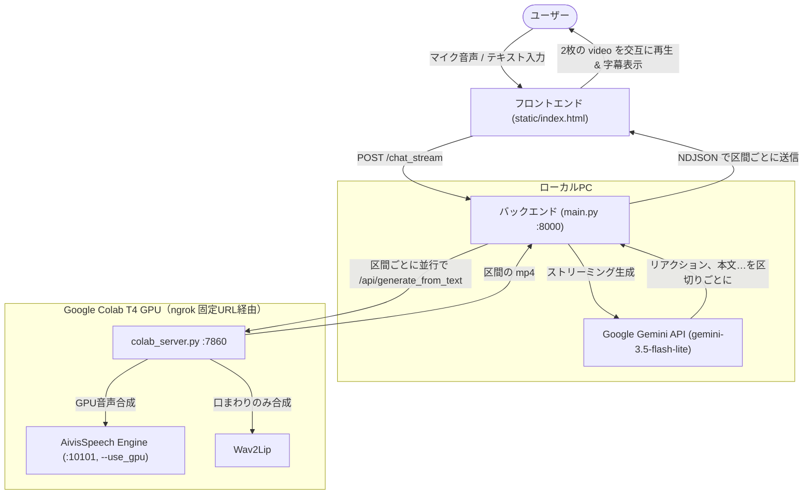

# LipSync AI Chat (Memorial API)

対話型AIアバター（デジタルヒューマン）システム。
ユーザーが音声またはテキストで話しかけると、**Gemini（思考） ➔ AivisSpeech（音声合成） ➔ Wav2Lip（口パク動画合成）** のパイプラインが Google Colab の GPU 上で動き、Webブラウザ上でアバターが返事をします。

返事は短いリアクション（えー、/ そっか、など）と本文に分かれて流れ作業で作られ、**話しかけてから約2秒で話し始めます**。区間のつなぎ目に空白はなく、待機中と会話中で顔の見た目や頭の位置が変わらないように合成しています。

さらに、**任意の顔写真1枚をアップロードするだけで、その人物の呼吸・まばたき待機動画と顔キャッシュを全自動生成**し、対話相手を切り替えられます。

---

## 1. システムアーキテクチャ



- Colab の GPU 音声合成が準備できるまで（起動直後の数十秒〜数分）や失敗時は、自動でローカルの AivisSpeech（CPU）で声を作り、Colab の `/api/generate` で口パクだけを作る方式に切り替わります。
- 待機動画は会話中も裏で再生し続け、その再生位置を時計として、各区間を再生開始時点に待機動画が映しているコマから合成します（`/api/sync_idle` で待機動画を Colab の合成元ループと同期）。

---

## 2. フォルダ構成と主要ファイルの役割

```text
C:\dev\memorial-api\          ← 実際に起動するのはこのフォルダ（LipSync起動.bat が優先）
├── main.py                     # FastAPI メインサーバー（ポート 8000）
├── colab_server.py             # Colab で動かす常駐サーバー（起動時に GitHub から取得）
├── procedural_motion.py        # 待機モーション（呼吸・ゆらぎ・まばたき）の生成
├── colab_start.ipynb           # VS Code から Colab を起動するノートブック（※Git管理外）
├── .env                        # APIキー等の秘密情報（※Git管理外）
├── static/
│   ├── index.html              # Web UI（対話画面、音声認識、アバター変更UI）
│   └── avatar_idle.mp4         # 待機ループ動画（Colab から自動同期）
├── face.jpg                    # 現在のアバター顔写真（原画）
├── AivisSpeech-Engine-Windows-x64-1.2.0/ # ローカル音声合成エンジン（ポート 10101、予備）
├── LipSync起動.bat             # ローカル側の一括起動
└── HUMAN_LIKE_EXPERIMENTS.md   # 人間らしさ向上の実験ロードマップ
```

---

## 3. 初回セットアップ

### Python 実行環境
* **Anaconda 環境名**: `grave`（`C:\Users\yamada\anaconda3\envs\grave\python.exe`）
* **主な導入パッケージ**: `fastapi`, `uvicorn`, `gradio_client`, `google-genai`, `requests` 等

### `.env`（main.py と同じフォルダ）
```text
GEMINI_API_KEY=（Google AI Studio で発行したキー）
COLAB_FIXED_URL=https://（ngrok の固定ドメイン）
```
APIキーはコードに書かず、必ずこのファイルに置いてください（`.gitignore` 済み）。

### `colab_start.ipynb` の ngrok 設定
ノートブック内の次の2行を、ngrok ダッシュボード（Your Authtoken / Domains）の値に書き換えます。
```python
os.environ["NGROK_AUTHTOKEN"] = "..."
os.environ["NGROK_DOMAIN"] = "xxxx.ngrok-free.dev"
```

---

## 4. 起動手順

### ステップ 1: VS Code で Colab を起動
1. VS Code で `colab_start.ipynb` を開く
2. 右上のカーネル選択で **Colab → New Colab Server → GPU → T4** を選ぶ
3. セルの **▶** を押す
4. 出力に `⚡ 【ngrok 固定トンネル起動完了】` が出たら会話できます
5. 続いて裏で GPU 音声合成の準備が進み、`🗣️ [GPU音声合成] 準備完了` が出ると話し始めがさらに速くなります

> [!TIP]
> Colab の出力をこちら側（エディタ外のツール等）から確認したいときは、ノートブックを **Ctrl+S で保存**すると出力がファイルに書き込まれます。

### ステップ 2: `LipSync起動.bat` をダブルクリック
- 音声合成エンジン（AivisSpeech、予備用）と FastAPI が最小化で起動し、ブラウザ（http://localhost:8000）が開きます。
- 音声エンジンの起動待ちは自動で行うので、すぐ話しかけても大丈夫です。

---

## 5. 主な仕様

1. **流れ作業の対話（/chat_stream）**
   * Gemini の返事をストリーミングで受け取り、最初のリアクション（読点まで）と以降の文ごとに区切って、区間ごとに並行して Colab へ依頼します。
   * Colab 側は同じ返事の区間を、音声合成だけ区間順に行い、前の区間の終了コマから次の区間を合成します（頭の動きが連続）。

2. **口まわりだけの合成**
   * Wav2Lip は顔全体を 96×96 で作り直すため、鼻の下から下だけをぼかしマスクで元の顔に合成し、目元は元の動画のくっきりした画質を保ちます。

3. **静止画1枚からのアバター自動セットアップ**
   * Web画面右上の 📷 写真を変更 から顔写真をアップロードすると、Colab 側で LivePortrait が 32 秒の待機ループ（呼吸・ゆらぎ・不規則なまばたき）と全フレームの顔座標キャッシュを生成します（T4 GPU で5〜10分）。
   * 生成物は Google Drive の `lipsync_avatar/` に保存され、前のアバターは `*_prev` として1世代残ります。

4. **感情（声と表情を一致）**
   * Gemini が返事ごとに感情（normal / happy / calm / sad）を選び、1回の返事は1つの感情で統一します。
   * 声は AivisSpeech のスタイル（まお: ノーマル / あまあま / おちつき / せつなめ）、顔は同じ名前の感情ループを使います。
   * 感情ループは頭の動きとまばたきが通常ループと完全に同じで、表情だけが違うため、感情が切り替わっても頭の位置は飛びません。
   * 写真を変更すると感情ループも自動で作られます（合計20〜30分）。今のアバターに感情ループだけ追加する場合は `POST /api/setup_emotions`（約15分）。
   * 表情の強さは Colab の `/api/emotion_presets` で調整でき、`/api/expression_preview` で試し撮りできます。

5. **固定URL（ngrok）**
   * Colab のサーバーは ngrok の固定ドメインで公開されるため、起動のたびに URL をコピーする必要はありません。
   * ngrok を設定しない場合は、従来どおり gradio.live の共有リンクで起動します（この場合は高速ルートが使えず遅くなります）。
